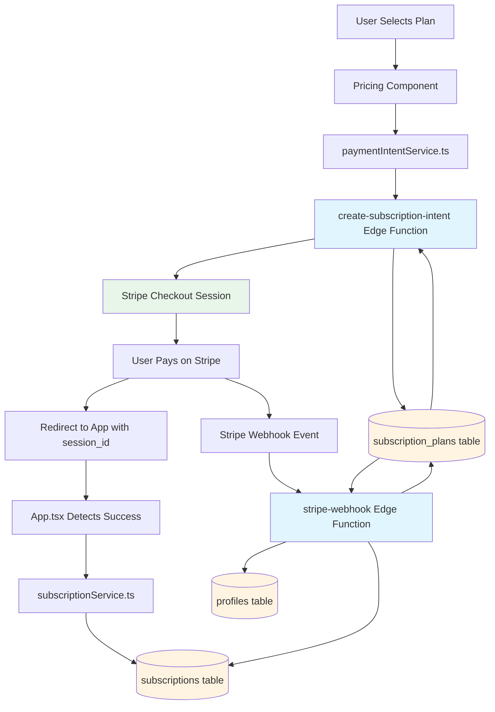
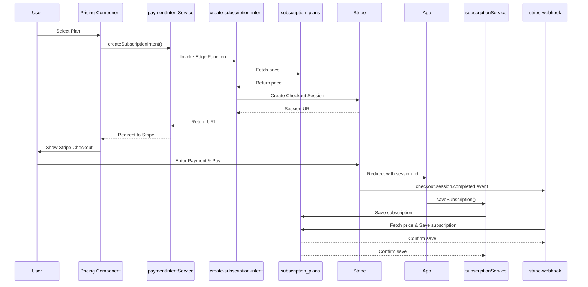

# Stripe Integration

Architecture Documentation

## Overview

LoadMaster uses Stripe for subscription payments with a serverless architecture built on Supabase Edge Functions. This eliminates the need for a separate backend server while maintaining security and reliability.

## Architecture Diagram




## Key Components

### 1. Frontend Payment Flow

**Entry Point:** [`components/Pricing.tsx`](components/Pricing.tsx)

- Displays subscription plans (Essential, Professional)
- Fetches prices from database via `getSubscriptionPlans()`
- User selects plan and billing interval (monthly/annual)
- Calls `createSubscriptionIntent()` to initiate checkout

**Payment Service:** [`services/paymentIntentService.ts`](services/paymentIntentService.ts)

- Invokes Supabase Edge Function: `create-subscription-intent`
- Returns Stripe Checkout Session URL
- Redirects user to Stripe's hosted checkout page

**Success Handling:** [`App.tsx`](App.tsx)

- Detects payment success from URL parameters
- Calls `saveSubscription()` to save subscription to database
- Displays payment confirmation

### 2. Edge Function: Create Checkout Session

**File:** [`supabase/functions/create-subscription-intent/index.ts`](supabase/functions/create-subscription-intent/index.ts)**Responsibilities:**

- Fetches pricing from `subscription_plans` table (no hardcoded prices)
- Creates Stripe Checkout Session with:
- `mode: 'subscription'` for recurring billing
- `unit_amount`: Price in cents (uses `annual_total` for annual subscriptions)
- Metadata: `planId`, `interval`, `userId`
- Success/cancel redirect URLs
- Returns checkout session URL to frontend

**Key Logic:**

- Monthly subscriptions: Uses `monthly_price` from database
- Annual subscriptions: Uses `annual_total` (full year amount, not monthly equivalent)
- All prices fetched from database - no fallbacks

### 3. Webhook Handler

**File:** [`supabase/functions/stripe-webhook/index.ts`](supabase/functions/stripe-webhook/index.ts)**Event Handling:**

- Listens for `checkout.session.completed` events
- Verifies webhook signature for security
- Extracts metadata (`planId`, `interval`, `userId`)
- Fetches price from database

**Database Operations:**

- Checks for existing subscription by `stripe_session_id` (prevents duplicates)
- Inserts subscription record into `subscriptions` table
- Updates `profiles` table with subscription info
- Handles duplicate key errors gracefully

### 4. Database Schema

**Subscription Plans Table:** `subscription_plans`

- Stores pricing configuration:
- `monthly_price`: Monthly subscription price
- `annual_price`: Monthly equivalent for annual billing
- `annual_total`: Full year amount charged upfront
- Single source of truth for all pricing

**Subscriptions Table:** `subscriptions`

- Stores subscription records:
- `user_id`: Links to user profile
- `plan`: 'essential' | 'professional' | 'enterprise'
- `interval`: 'month' | 'year'
- `status`: 'active' | 'canceled' | 'completed' | 'past_due'
- `amount`: Subscription amount
- `stripe_customer_id`, `stripe_subscription_id`, `stripe_session_id`
- `next_billing_date`: Calculated based on interval
- Unique constraint on `stripe_session_id` prevents duplicate entries

**Profiles Table:** `profiles`

- Updated with subscription metadata:
- `subscription_plan`: Current plan
- `subscription_status`: 'active' | 'canceled'
- `stripe_customer_id`, `stripe_subscription_id`

### 5. Service Layer

**Pricing Service:** [`services/pricingService.ts`](services/pricingService.ts)

- `getSubscriptionPlans()`: Fetches all active plans from database
- `getSubscriptionPlan()`: Gets price for specific plan/interval
- `getPlanPrices()`: Returns price map for backward compatibility
- Throws errors if Supabase not configured or plans not found

**Subscription Service:** [`services/subscriptionService.ts`](services/subscriptionService.ts)

- `saveSubscription()`: Saves subscription after payment
- Checks for duplicates by `stripe_session_id`
- Fetches price from database if not provided
- Calculates `next_billing_date`
- Updates user profile
- `getUserSubscriptions()`: Retrieves all subscriptions for user
- `getActiveSubscription()`: Gets current active subscription
- `cancelSubscription()`: Marks subscription as canceled

## Payment Flow Sequence




## Key Features

### 1. Database-Driven Pricing

- All prices stored in `subscription_plans` table
- No hardcoded prices anywhere in codebase
- Prices can be updated via database without code changes

### 2. Duplicate Prevention

- Unique constraint on `stripe_session_id` in `subscriptions` table
- Pre-insert checks in both frontend and webhook handler
- Graceful handling of duplicate key violations

### 3. Dual Save Mechanism

- **Frontend save**: Immediate save on redirect (user experience)
- **Webhook save**: Reliable backup save (handles edge cases)
- Both paths check for existing subscriptions before insert

### 4. Annual Billing Logic

- Checkout uses `annual_total` (full year amount) - user pays upfront
- Database stores `annual_price` (monthly equivalent) for consistency
- Webhook fetches `annual_price` from database for storage

### 5. Error Handling

- Comprehensive error messages for missing configuration
- Fallback error handling if database unavailable
- Logging for debugging payment issues

## Environment Variables

**Required in Supabase Edge Functions:**

- `STRIPE_SECRET_KEY`: Stripe API secret key
- `STRIPE_WEBHOOK_SECRET`: Webhook signature verification secret
- `SUPABASE_URL`: Supabase project URL
- `SUPABASE_SERVICE_ROLE_KEY`: Service role key (bypasses RLS)
- `FRONTEND_URL`: Application URL for redirects

## Security Considerations

1. **Webhook Signature Verification**: All webhook events verified using Stripe's signature
2. **Service Role Key**: Edge Functions use service role key (bypasses RLS) - stored securely
3. **No Client-Side Secrets**: Stripe secret key never exposed to frontend
4. **Metadata Validation**: Webhook validates required metadata before processing

## File Structure

```javascript
supabase/functions/
  ├── create-subscription-intent/
  │   └── index.ts          # Creates Stripe checkout sessions
  └── stripe-webhook/
      └── index.ts          # Handles Stripe webhook events

services/
  ├── paymentIntentService.ts    # Frontend service for checkout
  ├── subscriptionService.ts     # Subscription CRUD operations
  └── pricingService.ts          # Price fetching from database

components/
  └── Pricing.tsx                # Subscription selection UI

supabase_migrations/
  ├── 003_create_subscriptions_table.sql
  ├── 058_create_subscription_plans_table.sql
  └── 059_add_unique_constraint_stripe_session_id.sql
```


## Benefits of This Architecture

1. **No Separate Backend**: Uses Supabase Edge Functions (serverless)